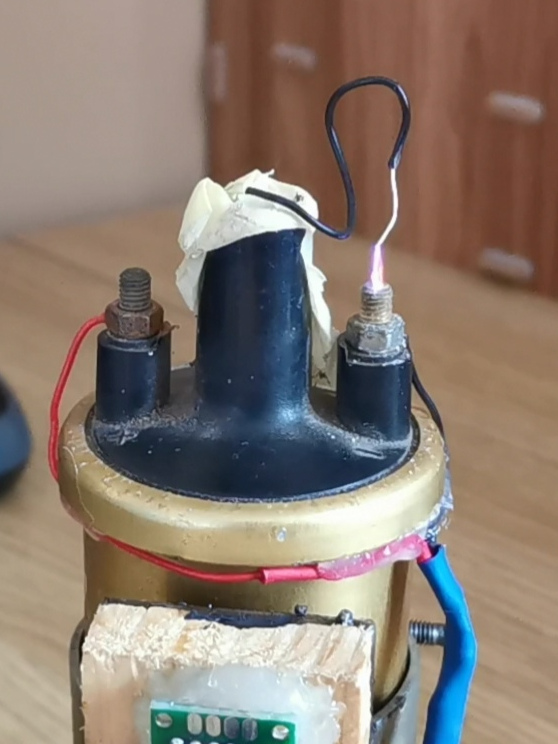
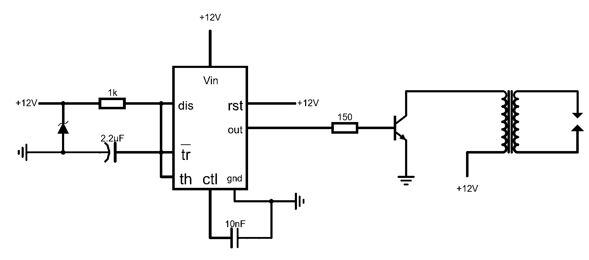

# High-Voltage-Spark-Gap
Using an astable 555 timer IC to drive an ignition coil in order to create continuous high voltage arcs across a spark gap.

 

## How does it work?
For a large spark to occur, a high voltage (of at least a few thousand volts) must be present. To achieve this, a step-up transformer
can be used, such as the car ignition coil used in this circuit.

To create a single spark, current is flown through the primary of the transformer and is then halted. A magnetic field will be created
when current is flown through the primary, and then the magnetic field will collapse when the current flow is halted. When the magnetic field
collapses, a high voltage is created in the secondary and we observe a spark (if the gap is small enough).
If the described process is repeated many times per second, then we get a continuous spark.

In order to repeatedly create sparks, an astable 555 timer has been used.
The astable 555 creates an oscillating square wave output, which is connected to the base of an NPN transistor. This will open and
close a pathway to the primary, at a high frequency, therefore creating continuous high voltage arcs.
